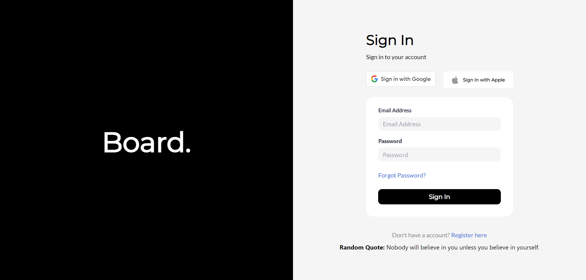

# Listed Assignment

This assignment was made using ReactJS and Tailwind. Axios is used to fetch data from the API.

## Instructions
1. install dependencies using ```npm install```
2. use ```npm start``` to start the project

## Dependencies Used
1. Tailwind
2. Axios

## Screens



P.S. - I have added the API on login screen. It fetches a random quote from quotable.io.